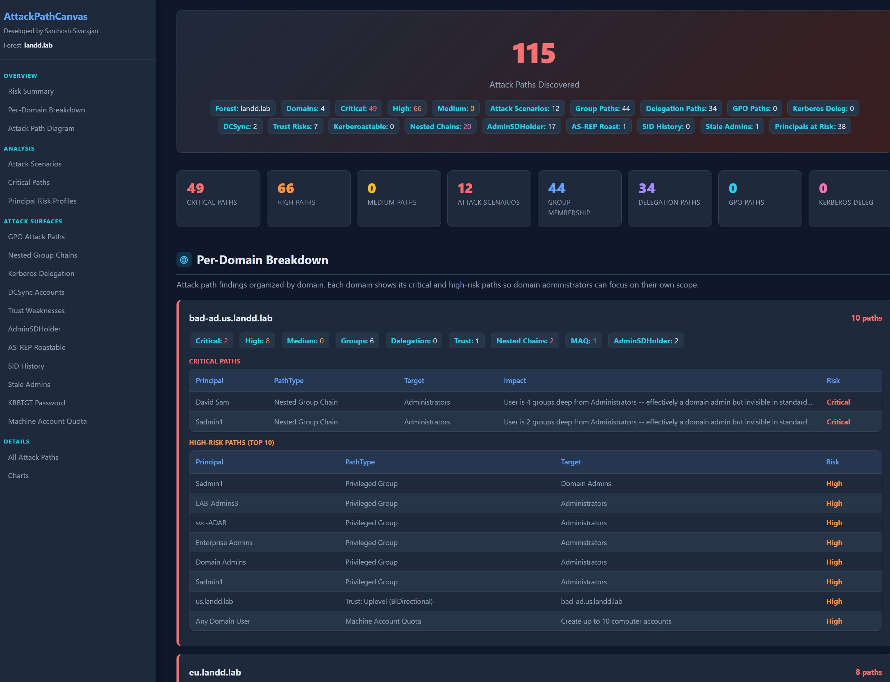
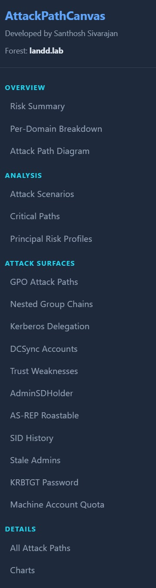
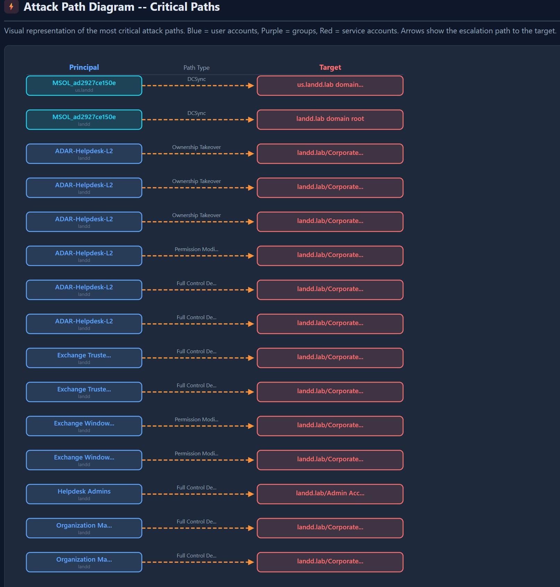
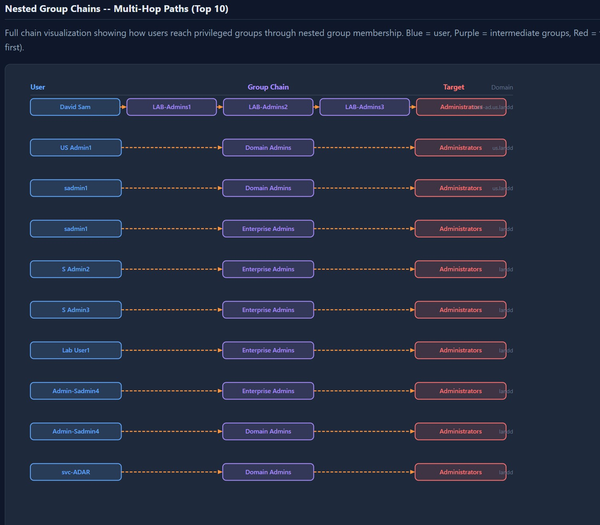
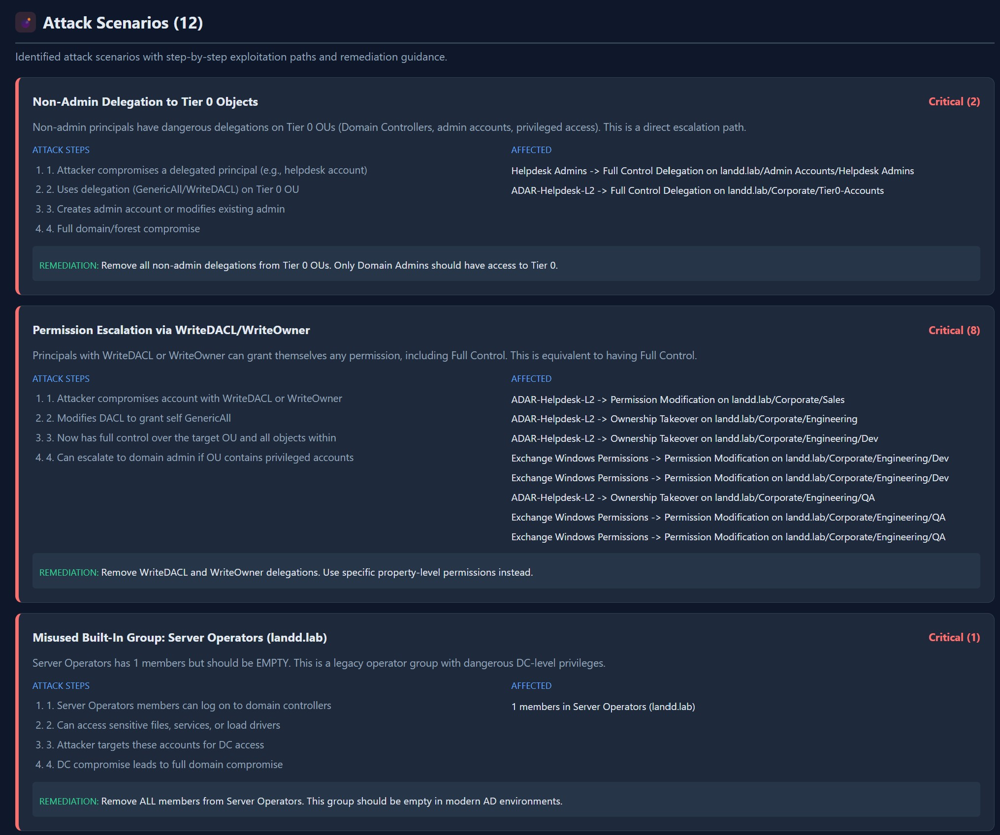
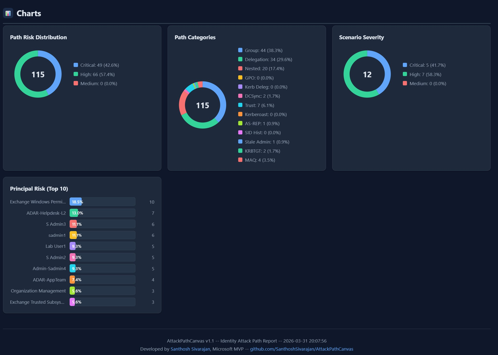

# AttackPathCanvas

### Visualize Identity Attack Paths in Active Directory

**Author:** Santhosh Sivarajan, Microsoft MVP
**GitHub:** [https://github.com/SanthoshSivarajan/AttackPathCanvas](https://github.com/SanthoshSivarajan/AttackPathCanvas)

---

## Note

I started working on this as a concept and a fun project. The idea came from the data I was already collecting with [DelegationCanvas](https://github.com/SanthoshSivarajan/DelegationCanvas) and [NHICanvas](https://github.com/SanthoshSivarajan/NHICanvas) -- I wanted to see if I could visualize the attack paths hidden in that data. What began as a quick experiment turned into something much more comprehensive than I originally planned.

I haven't decided whether to continue developing this or stop here. There are many possibilities -- especially if you are a developer and can take the collected data further with better visualizations, interactive graphs, or integration with other tools. I am not a developer, so this may be where I stop, but it was a fun project and I learned a lot building it.

---

## Overview

AttackPathCanvas discovers and visualizes identity attack paths in your Active Directory forest. It analyzes privileged group membership chains, dangerous delegation escalation paths, Kerberos delegation abuse, DCSync capabilities, trust weaknesses, and more -- then produces an interactive HTML report with SVG attack path diagrams and step-by-step attack scenario analysis.

Think of it as a lightweight, single-script an HTML output file.

## What It Discovers

### Phase 1: Privileged Group Membership Chains
- Direct and recursive membership in 9 Tier 0 groups across all domains
- Service accounts in admin groups (credential theft risk)
- Disabled accounts still in admin groups (re-enable attack)
- Nested group expansion with effective user counts

### Phase 1B: Nested Group Chain Walking
- Full recursive chain expansion up to 10 levels deep
- Discovers hidden admins buried in group nesting (e.g., User -> Group1 -> Group2 -> Group3 -> Domain Admins)
- Multi-hop SVG visualization showing the complete path

### Phase 2: Dangerous Delegation Paths
- GenericAll, WriteDACL, WriteOwner (full control / permission escalation)
- GenericWrite (broad attribute modification)
- Sensitive property writes: member, servicePrincipalName, msDS-KeyCredentialLink, msDS-AllowedToActOnBehalfOfOtherIdentity, userAccountControl, pwdLastSet
- ExtendedRight on All or Replication (DCSync via delegation)
- Tier 0 OU targeting (Domain Controllers, Admin, Privileged OUs)

### Phase 2B: GPO Attack Paths
- Non-admin principals with GPO edit permissions
- GPOs linked to Domain Controllers and Tier 0 OUs flagged as critical
- GPO modification = code execution on every system in scope

### Phase 2C: Kerberos Delegation
- Unconstrained delegation (TGT capture risk)
- Constrained delegation with/without protocol transition (S4U abuse)
- Resource-Based Constrained Delegation (RBCD)
- Delegation to DC services flagged as critical

### Phase 2D: DCSync-Capable Accounts
- Non-default accounts with Replicating Directory Changes on domain root
- Full DCSync capability detection (both replication rights present)
- Entra Connect sync account identification

### Phase 2E: Trust Analysis
- SID filtering status on all trusts
- Selective authentication configuration
- TGT delegation across trust boundaries
- External vs forest trust risk differentiation

### Phase 2F: AdminSDHolder and Kerberoastable Admins
- All accounts protected by AdminSDHolder (AdminCount=1)
- Admin accounts with SPNs (Kerberoastable by any domain user)

### Phase 2G: Identity Risk Indicators
- AS-REP Roastable accounts (pre-authentication disabled)
- SID History abuse (historical SIDs from migrations)
- Stale admin accounts (90+ days inactive, still enabled)
- KRBTGT password age (Golden Ticket persistence risk)
- Machine Account Quota (RBCD attack enablement)

### Phase 3: Attack Scenario Analysis
Automated detection of 16 attack scenario types with step-by-step exploitation paths:

| Scenario | Severity |
|---|---|
| Service Account with Admin Privileges | Critical |
| Disabled Accounts in Privileged Groups | High |
| Non-Admin Delegation to Tier 0 Objects | Critical |
| Permission Escalation via WriteDACL/WriteOwner | Critical |
| Credential Attack Paths (Shadow Creds / RBCD / Kerberoast) | High |
| Excessive Domain Admins | High |
| Misused Built-In Groups (Account/Server/Print/Backup Operators) | Critical |
| GPO Modification on Tier 0 Systems | Critical |
| Unconstrained Kerberos Delegation | Critical |
| Non-Default DCSync-Capable Accounts | Critical |
| Trust Security Weaknesses | Critical/High |
| Kerberoastable Privileged Accounts | Critical |
| Hidden Admins via Nested Group Chains | Critical |
| AS-REP Roastable Accounts | Critical/High |
| SID History Privilege Escalation | Critical/High |
| Stale Privileged Accounts | Critical/High |
| KRBTGT Password Not Rotated | Critical/High |
| Machine Account Quota Enables RBCD Attacks | High |

## Report Sections

1. **Risk Summary** -- Total paths with critical/high/medium breakdown
2. **Per-Domain Breakdown** -- Domain-specific findings with tables
3. **Attack Path Diagram** -- SVG visualization of critical paths with domain labels
4. **Multi-Hop Chain Diagram** -- SVG visualization of nested group chains (up to 10 levels)
5. **Attack Scenarios** -- Step-by-step exploitation analysis with remediation
6. **Critical Attack Paths** -- All critical-risk paths in detail
7. **Principal Risk Profiles** -- Top 25 principals ranked by blast radius
8. **GPO Attack Paths** -- GPO edit permissions on sensitive OUs
9. **Nested Group Chains** -- Full chain table with depth tracking
10. **Kerberos Delegation** -- Unconstrained, constrained, and RBCD
11. **DCSync Accounts** -- Non-default replication rights
12. **Trust Weaknesses** -- SID filtering, selective auth, TGT delegation
13. **AdminSDHolder** -- Protected accounts and Kerberoastable admins
14. **AS-REP Roastable** -- Pre-authentication disabled accounts
15. **SID History** -- Accounts carrying historical SIDs
16. **Stale Admins** -- Inactive admin accounts still enabled
17. **KRBTGT Password Age** -- Golden Ticket persistence risk
18. **Machine Account Quota** -- RBCD attack enablement
19. **All Attack Paths** -- Complete table of every discovered path
20. **Charts** -- Risk distribution, categories, scenario severity, principal risk

## Usage

```powershell
# Run from any domain-joined machine
.\AttackPathCanvas.ps1

# Custom output path
.\AttackPathCanvas.ps1 -OutputPath C:\Reports
```

## Requirements

- Windows PowerShell 5.1+ or PowerShell 7+
- **ActiveDirectory module** (RSAT)
- **GroupPolicy module** (optional, for GPO attack path detection)
- Domain user account (Domain Admin recommended for full visibility)

## Screenshots

### Executive Summary


### Section


### Attack Path (Direct)


### Attack Path (Nested)


### Attack Scenarios


### Chart


## License

MIT -- Free to use, modify, and distribute.

## Related Projects

- [ADCanvas](https://github.com/SanthoshSivarajan/ADCanvas) -- Active Directory documentation
- [EntraIDCanvas](https://github.com/SanthoshSivarajan/EntraIDCanvas) -- Entra ID documentation
- [IntuneCanvas](https://github.com/SanthoshSivarajan/IntuneCanvas) -- Intune documentation
- [ZeroTrustCanvas](https://github.com/SanthoshSivarajan/ZeroTrustCanvas) -- Zero Trust posture assessment
- [NHICanvas](https://github.com/SanthoshSivarajan/NHICanvas) -- Non-Human Identity governance
- [DelegationCanvas](https://github.com/SanthoshSivarajan/DelegationCanvas) -- AD delegation and permission mapping

---

*Developed by Santhosh Sivarajan, Microsoft MVP*
